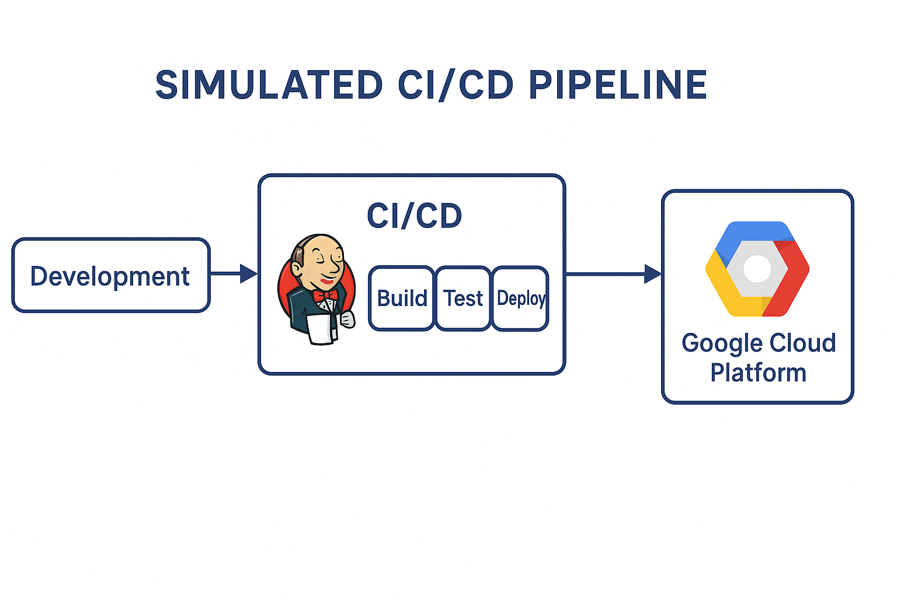

# CI/CD con Jenkins y Terraform en GCP (Simulado)  
# CI/CD with Jenkins and Terraform on GCP (Simulated)

Este proyecto demuestra como configurar un pipeline CI/CD utilizando Jenkins como orquestador y Terraform para definir infraestructura en Google Cloud Platform (GCP). Todo esta simulado para propositos de portafolio y presentacion profesional.

This project demonstrates how to set up a CI/CD pipeline using Jenkins as the orchestrator and Terraform to define infrastructure on Google Cloud Platform (GCP). Everything is simulated for portfolio and professional showcase purposes.

---

## Tecnologias utilizadas | Technologies Used

- Jenkins  
- Terraform  
- Bash  
- Python  
- Google Cloud Platform (simulado / simulated)  
- Docker  

---

## Objetivo | Objective

**ES:**  
Implementar un flujo CI/CD que:

1. Define infraestructura basica en GCP con Terraform (simulado)  
2. Instala y configura Jenkins  
3. Ejecuta despliegue automatico de una app Flask usando Jenkins

**EN:**  
Implement a CI/CD flow that:

1. Defines basic infrastructure in GCP with Terraform (simulated)  
2. Installs and configures Jenkins  
3. Automatically deploys a Flask app using Jenkins  

---

## Estructura del proyecto | Project Structure

```
ci-cd-jenkins-terraform/
├── terraform/              # Infraestructura como codigo | Infrastructure as Code
├── jenkins/                # Jenkinsfile y scripts de automatizacion | Jenkinsfile and automation scripts
├── app/flask-app/          # Aplicacion de ejemplo con Flask | Flask sample application
├── diagram.png             # Diagrama arquitectonico del flujo CI/CD | Architecture diagram
└── README.md
```

---

## Detalle de archivos | File Details

### `terraform/`
Contiene archivos simulados para definir una infraestructura basica en GCP usando Terraform.

- `main.tf`:  
  **ES:** Estructura principal del entorno, incluyendo maquina virtual Jenkins (simulado).  
  **EN:** Main structure for the environment, including Jenkins virtual machine (simulated).

- `variables.tf`:  
  **ES:** Variables reutilizables para la configuracion.  
  **EN:** Reusable variables for configuration.

- `outputs.tf`:  
  **ES:** Salidas clave como IPs o URLs (simuladas).  
  **EN:** Key outputs like IPs or URLs (simulated).

---

### `jenkins/`

- `Jenkinsfile`:  
  **ES:** Script declarativo que define las etapas del pipeline: Build, Test y Deploy.  
  **EN:** Declarative script that defines pipeline stages: Build, Test, and Deploy.

- `scripts/setup.sh`:  
  **ES:** Script simulado de instalacion/configuracion para Jenkins.  
  **EN:** Simulated setup script for Jenkins installation/configuration.

---

### `app/flask-app/`

Aplicacion Python minimalista para probar el pipeline CI/CD.

- `app.py`:  
  **ES:** Servidor web basico con Flask. Responde en `/`.  
  **EN:** Basic web server using Flask. Responds at `/`.

- `requirements.txt`:  
  **ES:** Dependencias necesarias para instalar la app.  
  **EN:** Required dependencies to run the app.

---

### `diagram`

**ES:** Representacion visual del flujo CI/CD: desde el desarrollador hasta el despliegue en GCP, pasando por Jenkins.  
**EN:** Visual representation of the CI/CD flow: from developer to deployment on GCP, via Jenkins.



---

## Sobre mi | About Me

**ES:**  
Soy Carlos Rodriguez, ingeniero DevOps con mas de 10 años de experiencia en la industria automotriz. Me especializo en automatizacion de pipelines CI/CD, infraestructura como codigo y consultoria tecnica para empresas que buscan escalar de forma eficiente y automatizada.

**EN:**  
I'm Carlos Rodriguez, a DevOps Engineer with over 10 years of experience in the automotive industry. I specialize in CI/CD pipeline automation, infrastructure as code, and technical consulting for companies aiming to scale efficiently and securely.

> Disponible para colaboracion freelance o consultoria | Available for freelance collaboration or consulting

---

## Contacto | Contact

**Email:** rolocaan@gmail.com  
**LinkedIn:** [www.linkedin.com/in/carlos-andres-r-98821455](https://www.linkedin.com/in/carlos-andres-r-98821455)  
**GitHub:** [rolocaan](https://github.com/rolocaan)
